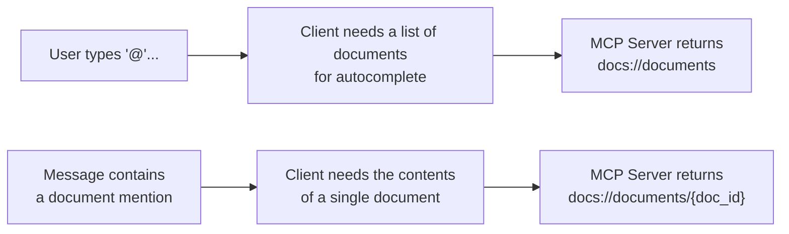
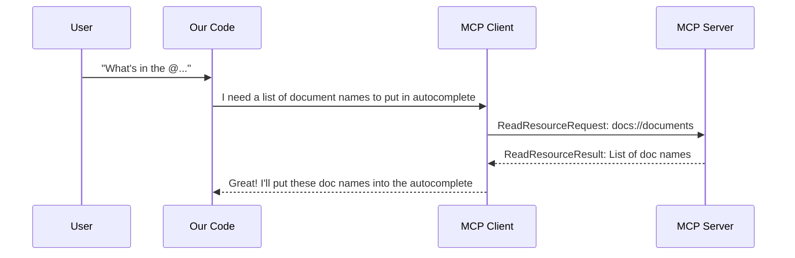
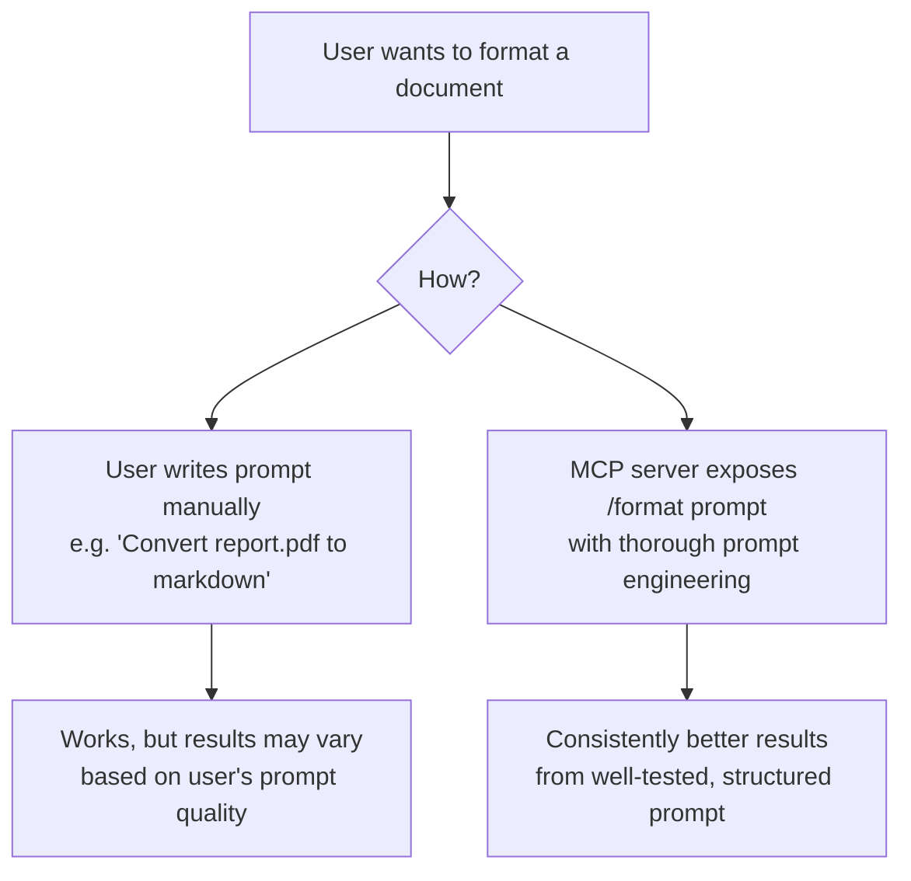
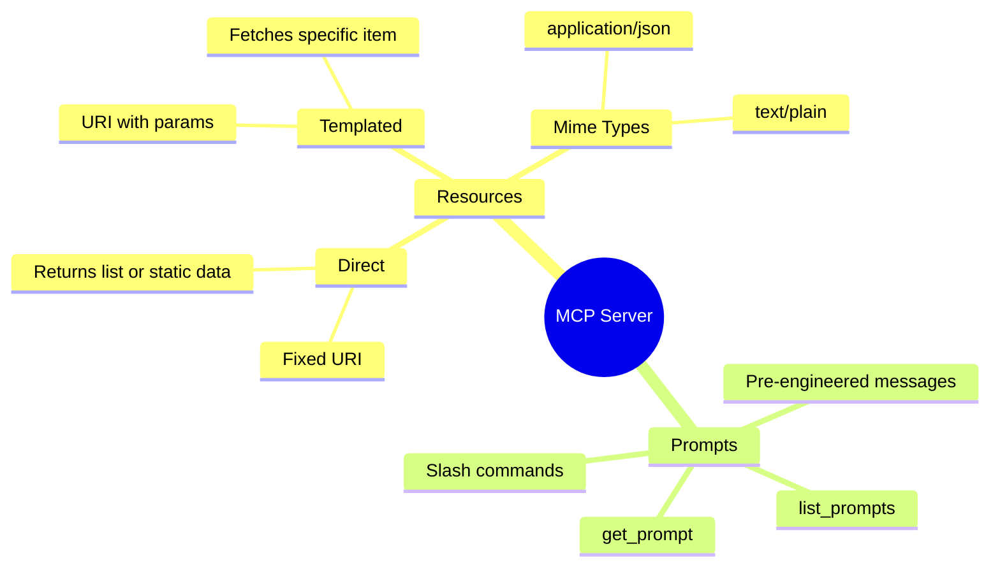

# MCP – Model Context Protocol

## MCP Client

### Why?

The client is what allows us to access functionality written inside the MCP server — for example, calling a tool or executing a tool defined on the server.

- Our CLI code uses the client to **get the list of tools** to pass to Claude.
- Our CLI code uses the client to **call a tool** (the client exposes server-side functionality that gets executed back on our codebase).

### 2 Mandatory Functions

- `list_tools()`
- `call_tool()`

### `list_tools()`

```python
async def list_tools(self) -> list[types.Tool]:
    result = await self.session().list_tools()  # session connects to the server
    return result.tools
```

### `call_tool()`

```python
async def call_tool(
    self, tool_name: str, tool_input: dict
) -> types.CallToolResult | None:
    return await self.session().call_tool(tool_name, tool_input)  # calls the tool requested by Claude
```


# Defining Resources in MCP

*Notes from: Saturday, 20 June 2026*

---

## What are Resources?

Resources allow the MCP Server to **expose data to the client**. They are similar to GET request handlers in a typical HTTP server.

- Can return any type of data — strings, JSON, binary, etc.
- The `mime_type` field gives the client a hint about the data being returned
- Two types: **Direct** and **Templated**

> Analogy: Similar to creating a GET API with parameters

---

## Two Types of Resources

| Type | Description |
|------|-------------|
| **Direct Resource** | URI doesn't contain any params |
| **Templated Resource** | URI contains one or more params. The Python SDK parses these and passes them as args to your function |

### Code Examples

**Direct Resource** — returns a list of document names:
```python
@mcp.resource(
    "docs://documents",
    mime_type="application/json"
)
def list_docs():
    # Return a list of document names
```

**Templated Resource** — returns the contents of a specific doc:
```python
@mcp.resource(
    "docs://documents/{doc_id}",
    mime_type="text/plain"
)
def fetch_doc(doc_id: str) -> str:
    if doc_id not in docs:
        raise ValueError(f"Doc with id {doc_id} not found")
    return docs[doc_id]
```

---

## When Resources Are Needed



---

## Resource Read Flow (Sequence)



---

## Accessing Resources (Client Side)

The `mime_type` is a hint to the client — if `application/json` is set, we parse the response as structured JSON:

```python
async def read_resource(self, uri: str) -> Any:
    result = await self.session().read_resource(AnyUrl(uri))
    resource = result.contents[0]
    if isinstance(resource, types.TextResourceContents):
        if resource.mimeType == "application/json":
            return json.loads(resource.text)
        return resource.text
```

---

## Prompts Feature in MCP

### What are Prompts?

Prompts define a set of **User and Assistant messages** that can be used by the client.

- Should be high quality, well-tested, and relevant to the overall purpose of the MCP
- Exposed as slash commands (e.g. `/format`)

### Use Case: `/format` Command

Users can ask Claude to "format" a document as markdown:

1. User types `/` to list all possible commands
2. User selects `/format` and specifies a document ID
3. Claude reads the document's contents, then prints a markdown-formatted version

> **Key insight:** Leaving this to a user-written prompt works, but using a thoroughly engineered server-side prompt gives much better results.

### Prompt Definition

```python
@mcp.prompt(
    name="format",
    description="Rewrites the contents of a document in Markdown format.",
)
def format_document(
    doc_id: str,
) -> list[base.Message]:
    # Return a list of messages
```

### Prompt Client Methods

```python
async def list_prompts(self) -> list[types.Prompt]:
    result = await self.session().list_prompts()
    return result.prompts

async def get_prompt(self, prompt_name, args: dict[str, str]):
    result = await self.session().get_prompt(prompt_name, args)
    return result.messages
```

---

## Prompts vs User-Written Instructions



---

## Summary


