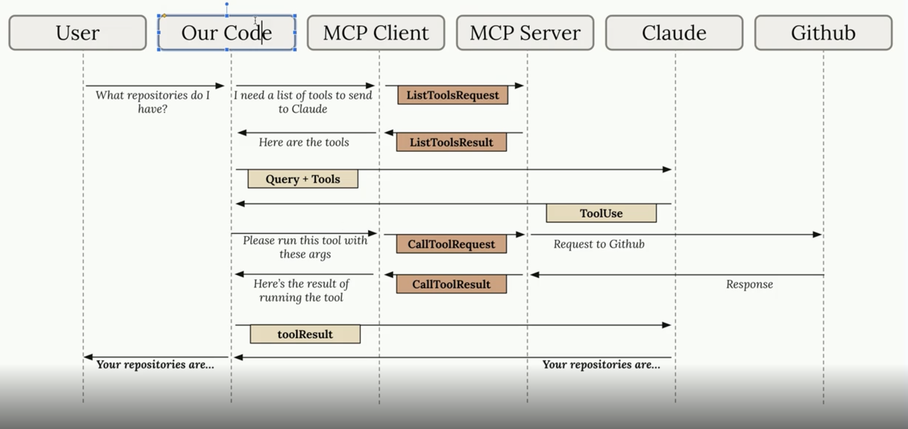

# MCP – Model Context Protocol

## MCP Client

### Why?

The client is what allows us to access functionality written inside the MCP server — for example, calling a tool or executing a tool defined on the server.

- Our CLI code uses the client to **get the list of tools** to pass to Claude.
- Our CLI code uses the client to **call a tool** (the client exposes server-side functionality that gets executed back on our codebase).

### 2 Mandatory Functions

- `list_tools()`
- `call_tool()`

### `list_tools()`

```python
async def list_tools(self) -> list[types.Tool]:
    result = await self.session().list_tools()  # session connects to the server
    return result.tools
```

### `call_tool()`

```python
async def call_tool(
    self, tool_name: str, tool_input: dict
) -> types.CallToolResult | None:
    return await self.session().call_tool(tool_name, tool_input)  # calls the tool requested by Claude
```

